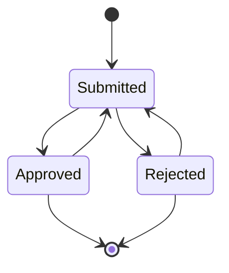

## SETUP - BACKEND

This is the backend part of the `tamed-state-machine` library. For full setup please refer to https://github.com/MehmetKaplan/tamed-state-machine.

Following steps should lead you to prepare a proper backend setup for the `tamed-state-machine`. After this setup the backend functions can be used with `tamed-state-machine-frontend` functions.

### IMPORTANT: This library does not focus on the authorization. It should be handled seperately.

A working example with below steps are here: https://github.com/MehmetKaplan/tamed-state-machine/tree/master/backend/tamed-state-machine-backend-server-example

1. Add the request handlers as a dependency of your project.

```bash
yarn add tamed-state-machine-backend
```

2. Add the library to your backend express server.

```javascript
const serialEntrepreneurBackendHandlers = require('tamed-state-machine-backend');
```

3. Initialize parameters (modify below object according to your environment)

Name below example configuration as `server-parameters.js` and place it in the root directory of your express server. This file is to be `require`d by your express server. **You should modify the credentials, secrets, etc, according to your environment.**

```javascript
module.exports = {
	pgKeys: {
		user: 'tsmapp',
		password: 'tsmapp.', // coming from database-setup/step00001.sql
		database: 'tsmdb',
		host: 'localhost',
		port: 5432,
	},
	httpsKeys: {
		keyPath: undefined, // modify this if https is to be used
		certPath: undefined, // modify this if https is to be used
	},
	port: process.env.TSM_PORT || 3000
}
```

4. Prepare your express server code. (Below can be used as an example.)

Name below example server as `tamed-state-machine-backend-server.js`:

```javascript
```

5. Finally start your server.

```bash
node tamed-state-machine-backend-server.js
```

6. Each time you need a state machine model it in the database first.

### Example

We'll try to implement a document approval flow as a state machine. Let's assume following are the states and transitions in a document approval flow:



To model this state machine in the database, we need to create a state machine with name `Document Approval` and description `Document Approval State Machine`. We need to create states and transitions as shown in the diagram above. The following SQL statements can be used to create the state machine:

```sql
-- STATE MACHINE
insert into tsm.state_machines (name, description) 
	values ('Document Approval', 'Test State Machine for Document Approval') 
	returning id into current_sm_id;
-- STATES
insert into tsm.state_machine_states (sm_id, state, state_type, description) 
	values
		(current_sm_id, 'Init', 'I', 'Initial State'),
		(current_sm_id, 'Submitted', 'S', 'Submitted State'),
		(current_sm_id, 'Approved', 'S', 'Approved State'),
		(current_sm_id, 'Rejected', 'S', 'Rejected State'),
		(current_sm_id, 'Closed', 'F', 'Final State');
-- TRANSITIONS
insert into tsm.state_machine_state_transitions (sm_id, from_state, transition_name, to_state, pre_transition_task_name, post_transition_task_name) 
	values
		(current_sm_id, 'Init', 'Submit', 'Submitted', 'preSubmit', 'postSubmit'),
		(current_sm_id, 'Submitted', 'Approve', 'Approved', 'preApprove', 'postApprove'),
		(current_sm_id, 'Submitted', 'Reject', 'Rejected', 'preReject', 'postReject'),
		(current_sm_id, 'Approved', 'Modify', 'Submitted', 'preModify', 'postModify'),
		(current_sm_id, 'Approved', 'Close', 'Closed', 'preClose', 'postClose'),
		(current_sm_id, 'Rejected', 'Modify', 'Submitted', 'preModify', 'postModify'),
		(current_sm_id, 'Rejected', 'Close', 'Closed', 'preClose', 'postClose');
```

Whenever the database is modified with new state machines, states, transitions, etc, the backend server will be able to read and use the definitions since we do not cache the state machine configurations. The rationale behind this is that we do not want to restart the backend server each time a new state machine is defined.