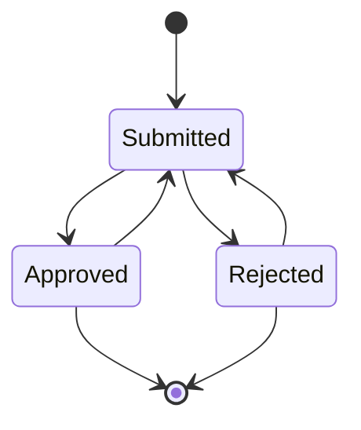

## SETUP - BACKEND

This is the backend part of the `tamed-state-machine` library. For full setup please refer to https://github.com/MehmetKaplan/tamed-state-machine.

This, `tamed-state-machine-backend` library, is a set of functions that read the state machine configurations within the database. And associate your application's objects with those state machines.

As a general rule this association is defined by following 3 parameters, which you can see frequently in the function parameters:

1. `externalName` - Connection to your application. This information is valuable for you, it defines which application you are connecting. The value is free text and `tamed-state-machine` keeps it for your association. (For example if you are implementing a document approval process, this is the name of the application that you are implementing the process for).
2. `externalId` - Connection to your application, here the value is usually the primary key of the connected document. (For example if you are implementing a document approval process, this is the **internal id of the document in your application**).

Once these functions are exposed as a backend server, they can be consumed by the `tamed-state-machine-frontend` functions.

**IMPORTANT: This library does not focus on the authorization. It should be handled separately.**

### API

#### `init`

| Parameter | Type | Description |
| --- | --- | --- |
| p_params | Object | Parameters for the backend server. |

`p_params`

| Key | Type | Value |
| --- | --- | --- |
| pgKeys | Object | PostgreSQL connection parameters. |
| applicationName | String | Application name. Not used, reserved for future. |


#### `initiateInstance`

Initializes a state machine instance. This instance is association between your application and a configured state machine.

| Parameter | Type | Description |
| --- | --- | --- |
| externalName| String | Connection to an application, here the value is a free-text. |
| externalId | String | Connection to an application, here the value is usually the primary key of the connected document. (For example if you are implementing a document approval process, this is the internal id of the document). |
| smName| String | Name of the state machine that is configured within the database. |
| generatedBy| String | The user that initiated the state machine. |

#### `getInstance`

Gets the instance of the state machine. This instance is association between your application and a configured state machine.

| Parameter | Type | Description |
| --- | --- | --- |
| externalName| String | Connection to an application, here the value is a free-text. |
| externalId | String | Connection to an application, here the value is usually the primary key of the connected document. (For example if you are implementing a document approval process, this is the internal id of the document). |
| smName| String | Name of the state machine that is being queried. |

#### `getPossibleTransitions`

Finds the state machine instance and returns the possible transitions for the current state.

| Parameter | Type | Description |
| --- | --- | --- |
| externalName| String | Connection to an application, here the value is a free-text. |
| externalId | String | Connection to an application, here the value is usually the primary key of the connected document. (For example if you are implementing a document approval process, this is the internal id of the document). |
| smName| String | Name of the state machine that the current state transitions are being queried. |

#### `transitionInstance`

Finds the state machine instance and performs the desired transition.

| Parameter | Type | Description |
| --- | --- | --- |
| externalName| String | Connection to an application, here the value is a free-text. |
| externalId | String | Connection to an application, here the value is usually the primary key of the connected document. (For example if you are implementing a document approval process, this is the internal id of the document). |
| smName| String | Name of the state machine that the state is requested to be transitioned. |
| transitionName| String | Name of the transition that is being requested. |
| transitionMadeBy| String | The user that requested the transition. |
| comment| String | Comment for the transition for instance history. |

#### `getInstanceHistory`

Finds the state machine instance and returns the history of the transitions.

| Parameter | Type | Description |
| --- | --- | --- |
| externalName| String | Connection to an application, here the value is a free-text. |
| externalId | String | Connection to an application, here the value is usually the primary key of the connected document. (For example if you are implementing a document approval process, this is the internal id of the document). |
| smName| String | Name of the state machine that the history is being queried. |

#### `getAllPossibleTransitions`

Gives the state machine transition configurations.

| Parameter | Type | Description |
| --- | --- | --- |
| smName| String | Name of the state machine that the transitions are being queried. |

#### `deleteInstance`

Deletes the state machine instance.

| Parameter | Type | Description |
| --- | --- | --- |
| externalName| String | Connection to an application, here the value is a free-text. |
| externalId | String | Connection to an application, here the value is usually the primary key of the connected document. (For example if you are implementing a document approval process, this is the internal id of the document). |
| smName| String | Name of the state machine that the instance is being deleted. |


A working example with below steps are here: https://github.com/MehmetKaplan/tamed-state-machine/tree/master/backend/tamed-state-machine-backend-server-example

1. Add the request handlers as a dependency of your project.

```bash
yarn add tamed-state-machine-backend
```

2. Add the library to your backend express server.

```javascript
const serialEntrepreneurBackendHandlers = require('tamed-state-machine-backend');
```

3. Initialize parameters (modify below object according to your environment)

Name below example configuration as `server-parameters.js` and place it in the root directory of your express server. This file is to be `require`d by your express server. **You should modify the credentials, secrets, etc, according to your environment.**

```javascript
module.exports = {
	pgKeys: {
		user: 'tsmapp',
		password: 'tsmapp.', // coming from database-setup/step00001.sql
		database: 'tsmdb',
		host: 'localhost',
		port: 5432,
	},
	httpsKeys: {
		keyPath: undefined, // modify this if https is to be used
		certPath: undefined, // modify this if https is to be used
	},
	port: process.env.TSM_PORT || 3000
}
```

4. Prepare your express server code. (Below can be used as an example.)

Name below example server as `tamed-state-machine-backend-server.js`:

```javascript
```

5. Finally start your server.

```bash
node tamed-state-machine-backend-server.js
```

6. Each time you need a state machine model it in the database first.

### Example

We'll try to implement a document approval flow as a state machine. Let's assume following are the states and transitions in a document approval flow:



To model this state machine in the database, we need to create a state machine with name `Document Approval` and description `Document Approval State Machine`. We need to create states and transitions as shown in the diagram above. The following SQL statements can be used to create the state machine:

```sql
-- STATE MACHINE
insert into tsm.state_machines (name, description) 
	values ('Document Approval', 'Test State Machine for Document Approval') 
	returning id into current_sm_id;
-- STATES
insert into tsm.state_machine_states (sm_id, state, state_type, description) 
	values
		(current_sm_id, 'Init', 'I', 'Initial State'),
		(current_sm_id, 'Submitted', 'S', 'Submitted State'),
		(current_sm_id, 'Approved', 'S', 'Approved State'),
		(current_sm_id, 'Rejected', 'S', 'Rejected State'),
		(current_sm_id, 'Closed', 'F', 'Final State');
-- TRANSITIONS
insert into tsm.state_machine_state_transitions (sm_id, from_state, transition_name, to_state, pre_transition_task_name, post_transition_task_name) 
	values
		(current_sm_id, 'Init', 'Submit', 'Submitted', 'preSubmit', 'postSubmit'),
		(current_sm_id, 'Submitted', 'Approve', 'Approved', 'preApprove', 'postApprove'),
		(current_sm_id, 'Submitted', 'Reject', 'Rejected', 'preReject', 'postReject'),
		(current_sm_id, 'Approved', 'Modify', 'Submitted', 'preModify', 'postModify'),
		(current_sm_id, 'Approved', 'Close', 'Closed', 'preClose', 'postClose'),
		(current_sm_id, 'Rejected', 'Modify', 'Submitted', 'preModify', 'postModify'),
		(current_sm_id, 'Rejected', 'Close', 'Closed', 'preClose', 'postClose');
```

Whenever the database is modified with new state machines, states, transitions, etc, the backend server will be able to read and use the definitions since we do not cache the state machine configurations. The rationale behind this is that we do not want to restart the backend server each time a new state machine is defined.