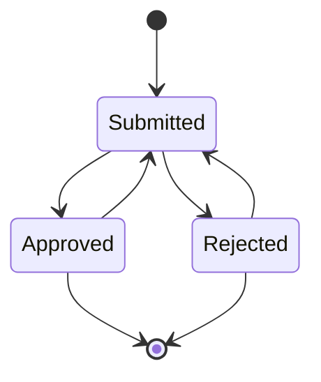

MODIFYME


### Example

We'll try to implement a document approval flow as a state machine. Let's assume following are the states and transitions in a document approval flow:



To model this state machine in the database, we need to create a state machine with name `Document Approval` and description `Document Approval State Machine`. We need to create states and transitions as shown in the diagram above. The following SQL statements can be used to create the state machine:

```sql
-- STATE MACHINE
insert into tsm.state_machines (name, description) 
	values ('Document Approval', 'Test State Machine for Document Approval') 
	returning id into current_sm_id;
-- STATES
insert into tsm.state_machine_states (sm_id, state, state_type, description) 
	values
		(current_sm_id, 'Init', 'I', 'Initial State'),
		(current_sm_id, 'Submitted', 'S', 'Submitted State'),
		(current_sm_id, 'Approved', 'S', 'Approved State'),
		(current_sm_id, 'Rejected', 'S', 'Rejected State'),
		(current_sm_id, 'Closed', 'F', 'Final State');
-- TRANSITIONS
insert into tsm.state_machine_state_transitions (sm_id, from_state, transition_name, to_state, pre_transition_task_name, post_transition_task_name) 
	values
		(current_sm_id, 'Init', 'Submit', 'Submitted', 'preSubmit', 'postSubmit'),
		(current_sm_id, 'Submitted', 'Approve', 'Approved', 'preApprove', 'postApprove'),
		(current_sm_id, 'Submitted', 'Reject', 'Rejected', 'preReject', 'postReject'),
		(current_sm_id, 'Approved', 'Modify', 'Submitted', 'preModify', 'postModify'),
		(current_sm_id, 'Approved', 'Close', 'Closed', 'preClose', 'postClose'),
		(current_sm_id, 'Rejected', 'Modify', 'Submitted', 'preModify', 'postModify'),
		(current_sm_id, 'Rejected', 'Close', 'Closed', 'preClose', 'postClose');
```

