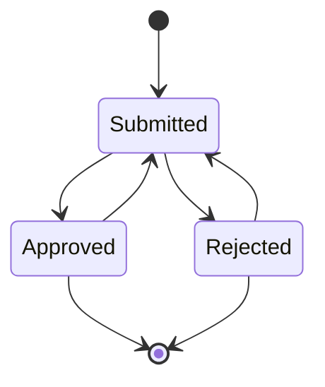

### Example

We'll try to implement a document approval flow as a state machine. Let's assume following are the states and transitions in a document approval flow:



1. Database setup

To model this state machine in the database, we need to create a state machine with name `Document Approval` and description `Document Approval State Machine`. We need to create states and transitions as shown in the diagram above. The following SQL statements can be used to create the state machine:

```sql
-- STATE MACHINE
insert into tsm.state_machines (name, description) 
	values ('Document Approval', 'Test State Machine for Document Approval') 
	returning id into current_sm_id;
-- STATES
insert into tsm.state_machine_states (sm_id, state, state_type, description) 
	values
		(current_sm_id, 'Init', 'I', 'Initial State'),
		(current_sm_id, 'Submitted', 'S', 'Submitted State'),
		(current_sm_id, 'Approved', 'S', 'Approved State'),
		(current_sm_id, 'Rejected', 'S', 'Rejected State'),
		(current_sm_id, 'Closed', 'F', 'Final State');
-- TRANSITIONS
insert into tsm.state_machine_state_transitions (sm_id, from_state, transition_name, to_state, pre_transition_task_name, post_transition_task_name) 
	values
		(current_sm_id, 'Init', 'Submit', 'Submitted', 'preSubmit', 'postSubmit'),
		(current_sm_id, 'Submitted', 'Approve', 'Approved', 'preApprove', 'postApprove'),
		(current_sm_id, 'Submitted', 'Reject', 'Rejected', 'preReject', 'postReject'),
		(current_sm_id, 'Approved', 'Modify', 'Submitted', 'preModify', 'postModify'),
		(current_sm_id, 'Approved', 'Close', 'Closed', 'preClose', 'postClose'),
		(current_sm_id, 'Rejected', 'Modify', 'Submitted', 'preModify', 'postModify'),
		(current_sm_id, 'Rejected', 'Close', 'Closed', 'preClose', 'postClose');
```

2. Backend server

* Add the request handlers as a dependency of your project.

```bash
yarn add tamed-state-machine-backend
```

* Prepare the database connection parameters in the `server-parameters.js` file:
  
```javascript
// MODIFY this file to change the server parameters
module.exports = {
	pgKeys: {
		user: 'tsmapp',
		password: 'tsmapp.', // coming from database-setup/step00001.sql
		database: 'tsmdb',
		host: 'localhost',
		port: 5432,
	},
	httpsKeys: {
		keyPath: undefined, // modify this if https is to be used
		certPath: undefined, // modify this if https is to be used
	},
	port: process.env.TSM_PORT || 3000
}
```

* Prepare the `express` server, we named this as `tamed-state-machine-backend-server-example.js`

```javascript
const express = require('express');
const app = express();
const https = require('https');
const fs = require('fs');
const path = require('path');
const bodyParser = require('body-parser');
const cors = require('cors');
const morgan = require('morgan');
const tickLog = require('tick-log');
const tsmb = require('tamed-state-machine-backend');

const serverParameters = require('./server-parameters.js');

const getParams = (body, query) => {
	if ((body) && (Object.keys(body).length > 0)) return body;
	return query;
}

const callHandler = async (req, res, handler, paramsArr) => {
	const params = getParams(req.body, req.query);
	try {
		let paramsToSend = [];
		for (let i = 0; i < paramsArr.length; i++) {
			paramsToSend.push(params[paramsArr[i]]);
		}
		let l_result = await tsmb[handler](...paramsToSend); // never use the return value, they are to be used for testing only
		let l_responseJSON = {
			result: 'OK'
		}
		if (l_result?.payload) l_responseJSON.payload = l_result.payload; // CHECK-BEFORE-BUILD Remove from README.md
		if (l_result?.rows) l_responseJSON.rows = l_result.rows;
		res.json(l_responseJSON);
	} catch (error) {
		res.json({
			result: 'FAIL',
			error: error
		});
	}
}

const startServer = async () => {
	await tsmb.init(
		{
			pgKeys: serverParameters.pgKeys,
			applicationName: 'YOUR APPLICATION NAME',
		}
	);

	app.use(bodyParser.json());
	app.use(bodyParser.urlencoded({ extended: true }));
	app.use(morgan('combined'));
	app.use(cors());
	app.options('*', cors());

	// http://localhost:3000/testHandler?test=123
	app.all('/testHandler', async (req, res) => { callHandler(req, res, 'testHandler', ['test']) });
	app.post('/getInstance', async (req, res) => { callHandler(req, res, 'getInstance', ['externalName', 'externalId', 'smName']) });
	app.post('/initiateInstance', async (req, res) => { callHandler(req, res, 'initiateInstance', ['externalName', 'externalId', 'smName', 'generatedBy']) });
	app.post('/deleteInstance', async (req, res) => { callHandler(req, res, 'deleteInstance', ['externalName', 'externalId', 'smName']) });
	app.post('/getPossibleTransitions', async (req, res) => { callHandler(req, res, 'getPossibleTransitions', ['externalName', 'externalId', 'smName']) });
	app.post('/transitionInstance', async (req, res) => { callHandler(req, res, 'transitionInstance', ['externalName', 'externalId', 'smName', 'transitionName', 'transitionMadeBy', 'comment']) });
	app.post('/getInstanceHistory', async (req, res) => { callHandler(req, res, 'getInstanceHistory', ['externalName', 'externalId', 'smName']) });
	app.post('/getAllPossibleTransitions', async (req, res) => { callHandler(req, res, 'getAllPossibleTransitions', ['smName']) });

	if ((serverParameters.httpsKeys.keyPath) && (serverParameters.httpsKeys.certPath)) {
		// if there are keys and certificates, use them
		https.createServer({
			key: fs.readFileSync(serverParameters.httpsKeys.keyPath),
			cert: fs.readFileSync(serverParameters.httpsKeys.certPath)
		}, app).listen(serverParameters.port, () => {
			tickLog.success(`HTTPS server listening on port ${serverParameters.port}.`);
		});
	}
	else {
		// In localhost go only for HTTP not HTTPS
		app.listen(serverParameters.port, () => {
			tickLog.success(`HTTP server listening on port ${serverParameters.port}.`);
		});
	}
}

startServer();
```

* Run the server

```bash
node tamed-state-machine-backend-server-example.js
```


3. Frontend client

* Add the request handlers as a dependency of your project.

```bash
yarn add tamed-state-machine-frontend
```

* Define the backend url.

```javascript
const apiBackend = 'http://development.computatus.com:61982'; // modify this with your backend
```

* Define your pre transition and post transition functions. 

```javascript
const preSubmit = (props) => { /*connected with your application here*/ return "preSubmit is called" }
const preApprove = (props) => { /*connected with your application here*/ return "preApprove is called" }
const preReject = (props) => { /*connected with your application here*/ return "preReject is called" }
const preModify = (props) => { /*connected with your application here*/ return "preModify is called" }
const preClose = (props) => { /*connected with your application here*/ return "preClose is called" }
const postSubmit = (props) => { /*connected with your application here*/ return "postSubmit is called" }
const postApprove = (props) => /*connected with your application here*/ { return "postApprove is called" }
const postReject = (props) => { /*connected with your application here*/ return "postReject is called" }
const postModify = (props) => { /*connected with your application here*/ return "postModify is called" }
const postClose = (props) => { /*connected with your application here*/ return "postClose is called" }
```

* Register your pre and post transition functions and backend API to the library.

```javascript
	tamedStateMachineFrontendHandlers.init({
		apiBackend: apiBackend,
		debugMode: false,
		preFunctions: {
			preSubmit,
			preApprove,
			preReject,
			preModify,
			preClose,
		},
		postFunctions: {
			postSubmit,
			postApprove,
			postReject,
			postModify,
			postClose,
		}
	});
```

* Find the document id in your application that will be used during library calls.

```javascript
const testExternalName = 'Test External Name'; // You name this freely, to differentiate from your other applications
const testStateMachineName = 'Test State Machine for Document Approval'; // previously configured at step 1
const testGeneratedBy = 'Test Generated By';
```

* Now the state machine frontend is ready to be consumed by your application. As first example we initiate an instance and change its state from `'Init'` to `'Submitted'`. While doing so we expect `preSubmit` and `postSubmit` functions to be called automatically because of the state machine configuration in the database and the function registrations in our above code..

```javascript
let possibleTransitions;

let externalID = ...; // your internal document id within your application
const fSuccess1 = (props, retval) => {
	console.log('SM Initiate Instance Success');
	possibleTransitions = retval.payload;
}
const fFail1 = (props, e) => {
	console.log('SM Initiate Instance Failure');
	throw e;
}
await tamedStateMachineFrontendHandlers.initiateInstance(testExternalName, externalID, testStateMachineName, testGeneratedBy, fSuccess1, fFail1);

const fSuccess2 = (props, retval) => {
	console.log('SM Instance State Transition Success');
}
const fFail2 = (props, e) => {
	console.log('SM Instance State Transition Failure');
	throw e;
}
let result = await tamedStateMachineFrontendHandlers.transitionInstance(testExternalName, externalID, testStateMachineName, 'Submit', testGeneratedBy, 'Frontend - transition test', possibleTransitions, fSuccess2, fFail2);
/*
	At this point result should be like this:
	{
		"preFuncResult": "preSubmit is called",
		"postFuncResult": "postSubmit is called"
	}
*/
```


* Now lets make couple of transitions like `Init-->Submitted-->Rejected-->Modified-->Approved-->Closed` and get the history of the state machine instance.

```javascript
let externalID = ...; // your internal document id within your application
let counter = 0;
const fS = (props, retval) => {
	console.log(`Step ${counter} backend call succeeded`);
}
const fF = (props, e) => {
	console.log('SM Instance State Transition Failure');
	throw e;
}
counter++; // Step 1
await tamedStateMachineFrontendHandlers.initiateInstance(testExternalName, externalID, testStateMachineName, testGeneratedBy, fS, fF);
counter++; // Step 2
await tamedStateMachineFrontendHandlers.transitionInstance(testExternalName, externalID, testStateMachineName, 'Submit', testGeneratedBy, 'Frontend - transition test', undefined, fS, fF);
counter++; // Step 3
await tamedStateMachineFrontendHandlers.transitionInstance(testExternalName, externalID, testStateMachineName, 'Reject', testGeneratedBy, 'Frontend - transition test', undefined, fS, fF);
counter++; // Step 4
await tamedStateMachineFrontendHandlers.transitionInstance(testExternalName, externalID, testStateMachineName, 'Modify', testGeneratedBy, 'Frontend - transition test', undefined, fS, fF);
counter++; // Step 5
await tamedStateMachineFrontendHandlers.transitionInstance(testExternalName, externalID, testStateMachineName, 'Approve', testGeneratedBy, 'Frontend - transition test', undefined, fS, fF);
counter++; // Step 6
await tamedStateMachineFrontendHandlers.transitionInstance(testExternalName, externalID, testStateMachineName, 'Close', testGeneratedBy, 'Frontend - transition test', undefined, fS, fF);

const fSuccess = (props, retval) => {
	// here retval.payload gives us the instance's transition history
}
const fFail = (props, e) => {
	console.log('SM Instance History call failure');
	throw e;
}
await tamedStateMachineFrontendHandlers.getInstanceHistory(testExternalName, externalID, testStateMachineName, fSuccess, fFail);
```

#### More Examples

You may find our internal code that we used to test the library useful as well:

* Backend: You can find the full example backend code in the [tamed-state-machine-backend-example](https://github.com/MehmetKaplan/tamed-state-machine/tree/master/example/backend/tamed-state-machine-backend-server-example).
* Frontend: You can find a simulation of a frontend application as a `Jest` test suite [here](https://github.com/MehmetKaplan/tamed-state-machine/blob/master/frontend/__tests__/tamed-state-machine-frontend.test.js).
